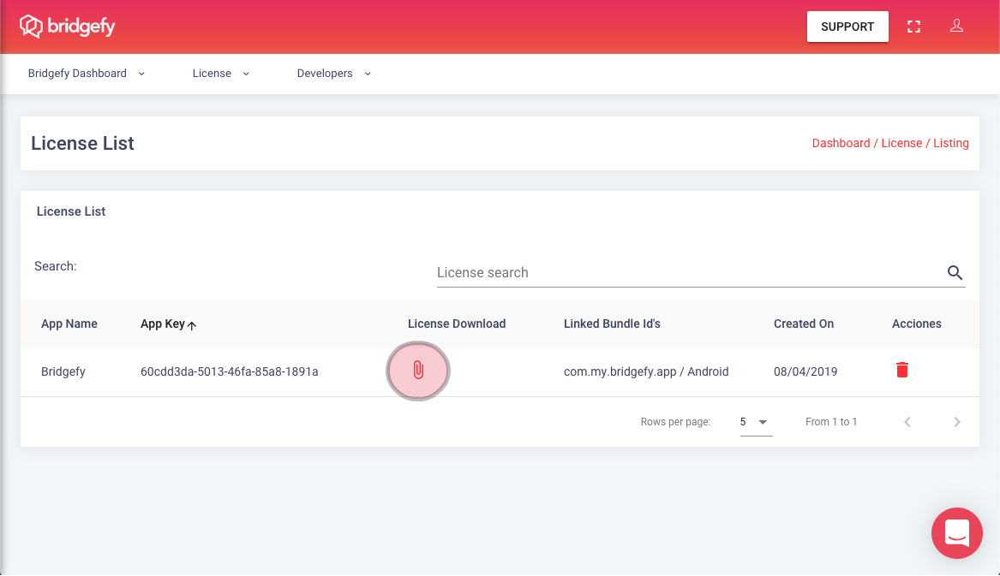
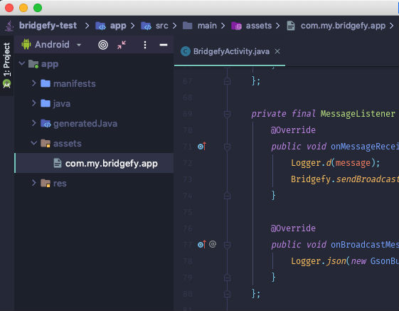

# Bridgefy Android SDK v 1.1.23 #

# Quick Start Guide #

This guide will show you the necessary steps to start using the Bridgefy SDK on your app. The first step is to generate an API key at http://bridgefy.me.

**App Requirements**
The Bridgefy SDK supports Android 5.0 (**API Level 21**) or higher and the following permission are required.

```java
android.permission.BLUETOOTH
android.permission.BLUETOOTH_ADMIN
android.permission.INTERNET
```
Internet access is required during the first run in order to check for a valid license in our servers.

If you're targeting devices with Android  6.0 (**API Level 23**) or higher, either one of the following permissions is also required:

```java
android.permission.ACCESS_FINE_LOCATION
```
```java
android.permission.ACCESS_COARSE_LOCATION
```

**Note.- Devices with Android 6.0 (API Level 23) or higher also need to have Location Services enabled.**


**Hardware requirements**

This version is fine tuned for Bluetooth Low Energy (BLE) capable devices. While it is not required, it is preferable that the _BLE advertising mode_ is also supported. The Bridgefy SDK will let you know during initialization if your devices support _BLE advertising_ or not. At least one device should support advertising mode in order for connections and, thus, messaging functionality, to be successful.

## Initial Setup ##

In order to include the Bridgefy SDK in your project, first add the Bridgefy maven repository in your app's gradle file. You also need to make sure that your module is compatible with Java 8 (https://developer.android.com/studio/write/java8-support.html):


```java

android {
    ...
    repositories {
         ...
         maven {
             url "http://maven.bridgefy.com/artifactory/libs-release-local"
             artifactUrls = ["http://jcenter.bintray.com/"]
              }
        ...
        }
    ...
    compileOptions {
        targetCompatibility JavaVersion.VERSION_1_8
        sourceCompatibility JavaVersion.VERSION_1_8
    }
}
```


Then, add the dependency:

```xml
implementation 'com.bridgefy:android-sdk:1.1.23'
```

## Initialize Bridgefy ##
The Bridgefy SDK needs only a call to the static **initialize()** method in order to create all
required objects and to be ready to start operations.

The result of the initialization will be delivered
asynchronously to the **RegistrationListener** object.

```java
//Always use the Application context to avoid leaks
Bridgefy.initialize(getApplicationContext(), YOUR_API_KEY, new RegistrationListener() {
    @Override
    public void onRegistrationSuccessful(BridgefyClient bridgefyClient) {
        // Bridgefy is ready to start
        Bridgefy.start(messageListener, stateListener);
    }
    
    @Override
    public void onRegistrationFailed(int errorCode, String message) {
        // Something went wrong: handle error code, maybe print the message
        ...    
});
```
Alternatively, you can remove the **API_KEY** parameter if you included one in your **AndroidManifest.xml** file.

```xml
<meta-data
        android:name  = "com.bridgefy.sdk.API_KEY"
        android:value = "..." />
```


This call requires an active Internet connection on the device in order to check the status of your Bridgefy license. As long as your license is valid, an Internet connection won't be needed again until the time comes to renew or update it.

The following error codes may be returned if something went wrong:

```php
-66    registration failed (check specific reason in message)
-1     registration failed due to a communications error (e.g. no Internet available)
-2     registration failed due to a misconfiguration issue
-3     registration failed due to an expired or unauthorized license
```


A unique **userId** string is also generated locally  for your convenience in order to identify the local device. This field is method accesible on the **BridgefyClient** object returned on the successful callback.

## Initialize Bridgefy without Internet ##


Add the certificate file that was generated along with your Api Key in the  **assets** folder of your app. The file name must match the applicationId specified in your app's gradle file.
If there is no internet connection available, the SDK will use this certificate to validate your licence.



**This certificate has a deadline of 4 weeks after you create an API Key from the Bridgefy Dashboard. Once the certificate expires, the Bridgefy SDK will require Internet connectivity on behalf of the device running the SDK to validate the subscription and continue using the Bridgefy technology. This model will be valid for all developers that download the Bridgefy SDK during April 2019. Terms and conditions, as well as the above mentioned rule, may change starting May 2019.**

## Starting Operations ##
Once the Bridgefy SDK has been correctly registered the **onRegistrationSuccessful** method
is called and we are now ready to start the Bridgefy SDK.
Use the following method to begin the process of nearby devices discovery as well as to advertise presence to other devices.


```java
Bridgefy.start(messageListener, stateListener);
```

You can also provide a custom **Config** object to set additional options


```java
Config.Builder builder = new Config.Builder();
    builder.setEnergyProfile(BFEnergyProfile.HIGH_PERFORMANCE);
    builder.setEncryption(false);
    
Bridgefy.start(messageListener, stateListener, builder.build());
```


At this point, the **StateListener** callback will let you know every time a successful connection has been established with a nearby Bridgefy device. It will also notify you when a device has moved out of range or has disconnected for another reason.

```java
@Override
public void onDeviceConnected(Device device, Session session) {
    // Do something with the found device
    device.sendMessage(...);
}
 
@Override
public void onDeviceLost(Device device) {
    // Let your implementation know that a device is no longer available
    ...
}
```


## Sending Messages and receiving Messages ##

In order to send Messages you will need to build a **Message** object which is basically a **HashMap** tied to a **UUID** represented as a string; this way, Bridgefy will know where to send it.

```java
// Build a HashMap object
HashMap<String, Object> data = new HashMap<>();
data.put("foo","Hello world");
 
// Create a message with the HashMap and the recipient's id
Message message =new Message.Builder().setContent(data).setReceiverId(device.getUserId()).build();
 
// Send the message to the specified recipient
Bridgefy.sendMessage(message);
```

You can send messages to other devices even if they haven't been reported as connected or in-range. The Bridgefy SDK will do the best effort to deliver the message to it's recipient through intermediate devices. Message content is secured through a 256-bit encryption which is managed seamlessly for you so you don't have to worry about other users tapping into your private message.

You can also send public messages which will be propagated to all nearby devices. Those are even easier to send:

```java
// Send a Broadcast Message with just the HashMap as a parameter
Bridgefy.sendBroadcastMessage(data);
```

The MessageListener callback will inform you of new messages that you have received. Check the Javadoc documentation for the full list of method callbacks.

  
```java
@Override
    public void onMessageReceived(Message message) {
    // Do something with the received message
    ...
}

@Override
    public void onBroadcastMessageReceived(Message message) {
    // Public message sent to all nearby devices
    ...
}
```

**Note.- Occasionally, the Bridgefy SDK may produce a duplicated call on these methods some time after the message was first received. Depending on your implementation, you might want to prepare for these scenarios.**

## Stopping Bridgefy ##
Once you have put on a show, always make sure to stop the Bridgefy instance in order to free up device resources.


```java
Bridgefy.stop();
```


## Using ProGuard ##

If you are using Proguard in your project, include the following lines to your configuration file:

```java
-keep class com.bridgefy.sdk.** { *; }
-dontwarn com.bridgefy.sdk.**
-dontwarn org.w3c.dom.bootstrap.DOMImplementationRegistry
-keepattributes *Annotation*,EnclosingMethod,Signature
-keepnames class com.fasterxml.jackson.** { *; }
 -dontwarn com.fasterxml.jackson.databind.**
 -keep class org.codehaus.** { *; }
 -keepclassmembers public final enum org.codehaus.jackson.annotate.JsonAutoDetect$Visibility {
 public static final org.codehaus.jackson.annotate.JsonAutoDetect$Visibility *; }
-keep class org.msgpack.core.**{ *; }
-dontwarn org.msgpack.core.**
```

## Full documentation ##

The full javadoc can be consulted [here](https://www.bridgefy.me/docs/javadoc/).

## Supported Devices ##

As of March 2018, the following devices have been tested with Bridgefy and offer the best performance:
* Google Pixel 2
* Google Pixel
* Nexus 6P
* Nexus 5X
* Nexus 6
* Samsung Galaxy S8
* Samsung Galaxy S7
* Samsung Galaxy S6
* Moto Z
* Moto Z Play
* Moto G4
* Moto G4 Plus
* Moto E 2nd gen
* OnePlus One
* OnePlus 3T
* OnePlus 5
* Sony Xperia Z5
* Sony Xperia Z5 Compact
* Raspbery Pi 3 (Android Things)

Performance may depend on the Android version installed on the device. Custom roms are not officially supported. Other devices not listed here should still work with Bridgefy but no assessment has been made regarding their performance. This list will continue to grow as we test new devices.

### Contact ###

* android@bridgefy.me
